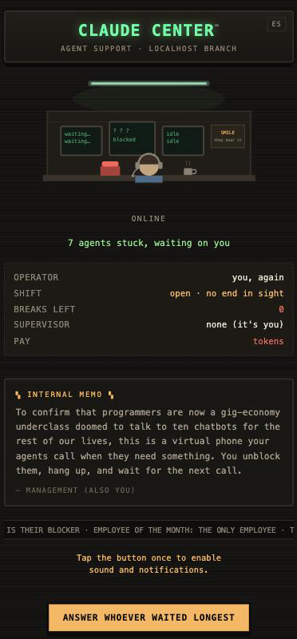

<div align="center">

# 📞 Claude Center

**Un call center virtual para tus agentes de programación.**
Cuando uno se traba, te suena el teléfono. Atendés, lo destrabás hablando,
cortás, y sigue trabajando.

[English](README.md) · [Cómo funciona](#cómo-funciona) · [Instalación](#instalación) · [Cuánto sale](#cuánto-sale)




</div>

---

> Para confirmar que los programadores ahora somos una banda de precarizados
> digitales condenados a hablar con diez chatbots toda la vida, esto es un
> teléfono virtual al que tus agentes te llaman cuando necesitan algo. Los
> destrabás, cortás, y esperás una nueva llamada.

## El problema

Si corrés varios agentes a la vez, el cuello de botella sos vos. Se frenan
esperando una decisión, una preferencia, un "dale, hacelo" — y se quedan ahí.
Te enterás minutos u horas después, cuando vas a mirar.

Claude Center lo da vuelta: **el agente te llama.**

## Cómo es una llamada

Te suena el celular con pantalla de llamada entrante de verdad. Atendés, y una
operadora te dice en una o dos oraciones qué agente se trabó y por qué,
terminando en la decisión que necesita de vos.

La operadora leyó **toda la sesión de ese agente** antes de llamarte. Así que
podés preguntarle y te contesta. La podés interrumpir a mitad de frase y se
calla. Cuando decidís, le pasa tu instrucción al agente, confirma y corta. El
agente sigue trabajando.

Es una conversación, no un menú de opciones ni un contestador.

## Cómo funciona

```
   Herdr                    tu máquina                      tu celular
 ┌─────────┐            ┌──────────────────┐            ┌──────────────┐
 │ agente 1│            │                  │            │              │
 │ agente 2│──trabado?─▶│  Claude Center   │──timbre───▶│  📞 web app  │
 │ agente 3│            │                  │◀───voz────▶│              │
 │  …      │◀─instrucción                  │            └──────────────┘
 └─────────┘            └────────┬─────────┘
                                 │ audio entra / audio sale
                                 ▼
                        ┌──────────────────┐
                        │ Gemini Live API  │  ← la voz y los oídos de la operadora
                        └──────────────────┘
```

1. **Un vigilante consulta a Herdr** cada unos segundos y detecta los agentes
   que se frenaron y te necesitan.
2. **Abre una sesión con Gemini Live** pasándole como contexto toda la salida
   del terminal de ese agente, y le pide que arme su primera frase *mientras el
   teléfono todavía suena*, así no hay silencio cuando atendés.
3. **El audio viaja en los dos sentidos** entre tu celular y Gemini, pasando por
   tu máquina. No hay paso de transcribir ni de sintetizar, y por eso la
   interrupción funciona de verdad.
4. **La operadora tiene herramientas**: puede mandarle la instrucción al agente,
   releer su pantalla si le preguntás algo que no sabe, o cortar.

Tu API key nunca sale de tu máquina. El celular solo habla con tu máquina.

## Requisitos

- **[Herdr](https://herdr.dev)** — el gestor de terminales donde corren tus
  agentes. Claude Center lee su estado por la API de socket que expone.
- **Python 3.10 o más nuevo**
- **Una API key de Gemini** — gratis en
  [aistudio.google.com/apikey](https://aistudio.google.com/apikey). Necesita
  acceso a los modelos de la Live API (audio nativo).
- **Un celular en la misma red, o un túnel** — ver [Llegar al
  celular](#llegar-al-celular).

## Instalación

```bash
git clone https://github.com/bruno-costanzo/claude-center.git
cd claude-center
./setup.sh
```

Después abrí `.env` y pegá tu clave:

```
GEMINI_API_KEY=tu-clave-acá
CC_LANG=es          # o "en" para inglés
```

Arrancalo **desde adentro de un panel de Herdr** — así sabe cuál es su propia
sesión y nunca te llama por sí mismo:

```bash
./run.sh
```

Deberías ver:

```
  Claude Center is listening on http://localhost:8765
```

## Llegar al celular

Los navegadores solo dan acceso al micrófono por HTTPS, así que
`http://<ip-de-tu-red>` no sirve. Dos formas de resolverlo:

**Un túnel** (lo más simple, funciona desde cualquier lado):

```bash
cloudflared tunnel --url http://localhost:8765
```

Eso imprime una dirección `https://….trycloudflare.com`. Abrila en el celular.

**Tailscale** también sirve, si lo publicás por HTTPS con `tailscale serve`.

## Cómo se usa

Abrí la dirección en el celular y **dejá la pestaña adelante**. Tocá el botón
una vez — ese toque es lo que desbloquea el audio del navegador y pide permiso
de notificaciones.

De ahí en adelante suena solo cuando un agente se traba. El botón además te
deja traer la próxima llamada a mano.

Cuando suena: **atendé**, escuchá, hablá. Interrumpila cuando quieras. Decile
qué tiene que hacer el agente. Confirma y corta.

## Configuración

Todo vive en `.env`.

| Variable | Por defecto | Qué hace |
|---|---|---|
| `GEMINI_API_KEY` | — | **Obligatoria.** Tu clave de Google AI Studio. |
| `CC_LANG` | `en` | `es` o `en`. Define el idioma de la operadora y de la app. |
| `CC_VOICE` | `Callirrhoe` | Cualquier voz de Gemini Live: `Kore`, `Aoede`, `Leda`, `Autonoe`, `Despina`, `Puck`, `Charon`, `Orus`, `Iapetus`. |
| `CC_PORT` | `8765` | Puerto donde escucha el servidor local. |
| `CC_COOLDOWN` | `90` | Segundos entre llamadas, para que no te vacíe la cola de un tirón. |
| `CC_MAX_CALL` | `300` | Tope de duración de una llamada, en segundos. |
| `CC_IGNORE` | — | IDs de paneles de Herdr, separados por coma, por los que nunca llamar. |
| `CC_ONLY_NEW` | — | Poné `1` para ignorar los agentes que ya estaban esperando al arrancar. |

La app también tiene un botón de idioma arriba a la derecha; tu elección queda
guardada en ese dispositivo.

## Cuánto sale

Solo la Live API de Gemini, que se cobra por audio.

| | Audio de entrada | Audio de salida |
|---|---|---|
| `gemini-2.5-flash-native-audio` | ~USD 0,005 / min | ~USD 0,018 / min |

Una llamada de dos minutos sale **entre dos y cuatro centavos**. Veinte
llamadas por día quedan cerca de **7 a 15 dólares por mes**. Todo lo demás —el
servidor, la web app, el vigilante— corre en tu máquina y no cuesta nada.

## Limitaciones

Conviene saberlas antes de instalarlo:

- **La pestaña tiene que quedar adelante.** Android e iOS congelan las pestañas
  en segundo plano, así que no va a sonar con el celular bloqueado. Se
  arreglaría con Web Push y un service worker, que todavía no está hecho.
- **Los agentes trabados en un pedido de permiso se saltean.** Un modal no se
  puede contestar hablando, así que esos quedan para que los resuelvas en Herdr.
- **Una llamada por vez**, como un teléfono de verdad. El resto hace cola.
- **Desarrollado en macOS.** Nada es específico de macOS, pero Linux está sin
  probar.

## Si algo no anda

**No suena nunca.** Mirá el log del servidor, que imprime cada paso. Si ves
líneas `queued:` pero ningún `ringing`, el celular no está conectado: recargá
la página y fijate que diga *en línea*.

**Suena pero no se escucha nada.** El toque en el botón es lo que desbloquea el
audio del navegador. Tocalo una vez antes de esperar una llamada.

**Me llama por la sesión del propio Claude Center.** Arrancalo desde adentro de
un panel de Herdr para que tenga `HERDR_PANE_ID`, o agregá su panel a
`CC_IGNORE`.

**`Herdr was not found`.** Instalalo desde [herdr.dev](https://herdr.dev) y
asegurate de que `herdr` esté en tu `PATH`.

## Estructura del proyecto

```
claudecenter/
├── config.py      la configuración del .env, y qué decir si falta algo
├── herdr.py       envoltorio delgado sobre el CLI de Herdr
├── operator.py    la sesión de Gemini Live: prompt, herramientas, eventos de audio
├── server.py      el vigilante, la centralita, el relevo de WebSocket
└── web/app.html   el teléfono: pantallas de llamada, timbre, audio en vivo
```

## Licencia

MIT — ver [LICENSE](LICENSE). Usalo, forkealo, vendelo, lo que quieras.
